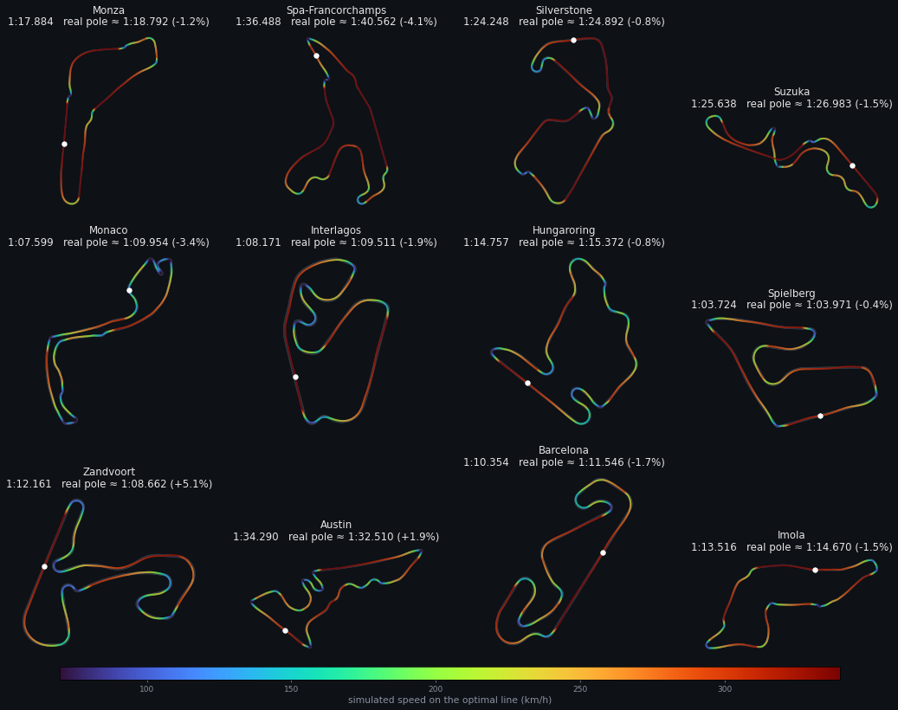

# APEX Physics — v0.2.0

The physics exists to make one thing true: **a better racing line gives a
faster lap, for reasons a player can see and learn.** Real-world accuracy
comes second to that.

Code: `packages/engine/src/physics/`. Entry point: `simulateLap({ track, line, car })`.

## Model

A quasi-steady-state point-mass lap simulation (the standard "lap time
simulator" approach), run on a closed flying lap.

### Car: `apex_formula_v2`

| Parameter | Value | Notes |
|---|---|---|
| mass | 750 kg | |
| power | 600 kW | at the wheels |
| μ | 1.8 | tyre friction, used both laterally and longitudinally (v1: 1.6) |
| CLA | 5.0 m² | downforce (v1: 3.5) |
| CDA | 1.1 m² | drag |
| half width | 1.0 m | for track limits |

Derived: top speed ≈ 349 km/h (power = drag). Grip at speed v is
`μ(g + kAero·v²)`: ~1.8 g at low speed, ~6 g at 300 km/h, so fast corners
(R ≳ 110 m) are flat out and hairpins are taken at ~80–90 km/h. It is a
generic formula-style car and does not model any real car.

### Calibration (v2)

v1 was tuned by feel and ran 6–17% slower than real pole laps. A grid scan
of μ × CLA over the fixed optimal lines of 12 real circuits
picked μ 1.8 / CLA 5.0 (mean ≈ −1%, sd ≈ 2%). Remaining error
comes mostly from track geometry: hand-traced corners, smoothing, and no
banking (Zandvoort +5.1%). Reference poles are approximate 2025
qualifying laps, used only as a sanity check (`check-tracks.ts`).

| Circuit | Optimal (sim) | Real pole ≈ | Δ |
|---|---|---|---|
| Monza | 1:17.884 | 1:18.792 | −1.2% |
| Spa-Francorchamps | 1:36.488 | 1:40.562 | −4.1% |
| Silverstone | 1:24.248 | 1:24.892 | −0.8% |
| Suzuka | 1:25.638 | 1:26.983 | −1.5% |
| Monaco | 1:07.599 | 1:09.954 | −3.4% |
| Interlagos | 1:08.171 | 1:09.511 | −1.9% |
| Hungaroring | 1:14.757 | 1:15.372 | −0.8% |
| Spielberg | 1:03.724 | 1:03.971 | −0.4% |
| Zandvoort | 1:12.161 | 1:08.662 | +5.1% |
| Austin | 1:34.290 | 1:32.510 | +1.9% |
| Barcelona | 1:10.354 | 1:11.546 | −1.7% |
| Imola | 1:13.516 | 1:14.670 | −1.5% |

### Pipeline per lap

1. **Line → points.** Knot offsets → periodic cubic spline of lateral
   offset → one point per centerline index (1000 on Kestrel, ~2.2 m apart).
2. **Curvature.** A three-point (Menger) circle through points ±5 m apart
   (`CURVATURE_STENCIL_M`), not neighbouring points (see Findings).
3. **Cornering limit.** The highest speed that can be *held* on curvature κ.
   Holding speed needs tyre force equal to drag, and that shares the
   friction circle with the cornering force:

   `(v²κ)² + (kDrag·v²)² = (μ(g + kAero·v²))²  ⇒  v² = μg / (√(κ² + kDrag²) − μ·kAero)`

   If the denominator is ≤ 0 the corner is flat out (top speed).
4. **Forward pass (acceleration).** `v²ₙₑₓₜ = v² + 2·a·ds`, where
   `a = min(remaining grip, P/(m·v)) − drag` and remaining grip is
   `grip·√(1 − (a_lat/grip)²)`: the friction circle.
5. **Backward pass (braking).** `v²ₚᵣₑᵥ = v² + 2·(remaining grip + drag)·ds`.
6. **Closed loop.** Both passes start at the slowest point on the lap and
   sweep it twice, so the flying lap is consistent across the start/finish.
7. **Time.** `dt = ds / mean(vᵢ, vᵢ₊₁)`, summed. The official result is
   `lapTimeMs = round(total × 1000)`. `rawLapTimeMs` is only for optimizers.

### Why exit speed matters (without special rules)

Acceleration is capped by power, and at speed it is much lower than braking
(braking gets grip plus drag). So speed gained by exiting early is carried
down the whole following straight, while speed lost by braking later is
cheap to recover. The asymmetry comes straight out of the forward and
backward passes: on Kestrel, apexing every corner 12 m early costs +1.30 s,
12 m late only +0.71 s.

## The racing line: per-corner knots

A line is **one lateral offset per knot** (`RacingLine.knotOffsets`,
metres, + = left, centimetre grid). Knots come from the track: entry
(25 m before), apex, and exit (25 m after) of each detected corner, plus
filler knots so no two are more than 200 m apart. Kestrel has 24.

Between knots the offset follows a periodic cubic spline in
(centerline index, offset) space. Because the spline is linear in the knot
values, `offsets = B · z` with a basis matrix B precomputed per track.

**Why not the raw drawing?** See Findings #2. The knot form keeps the
player's intent (turn-in, apex, exit) and throws away hand tremor. It also
makes submissions tiny (24 numbers), easy to validate, and the same
representation the optimizer searches.

### Player controls: gates (`line/controls.ts`)

The game no longer uses freehand drawing. Players set **gates**: the knots at
corners that cost at least 12 km/h on the centerline lap. Every other knot
is interpolated linearly between neighbouring gates, then limits are
enforced, iterated to a fixed point. The published `optimalLine` is
optimised in this same space, so targets are exactly reachable. It costs
0.1–1.3 s against an unconstrained optimum, which is irrelevant because
everyone plays in the same space.

### Drawing → line (`fitDrawing`, not used by the game since Phase 2b)

1. Densify the stroke to ≤ ½ centerline step.
2. Project each sample onto the centerline, tracking **locally** (±40 m
   window) so neighbouring parts of the track (hairpin legs) are never
   confused. If the local match is lost and the nearest point is elsewhere
   on the lap, the result is `CUT_CORNER`.
3. Average lateral offset per centerline index (clamped to the track edge).
4. Weighted least-squares fit of the knots (tiny ridge for stability).
5. `enforceLimits`: pull knots inward on the centimetre grid until the
   spline stays inside the track.

Direction does not matter (a line is a set of offsets). Brief finger
overshoots (< 15 m of track) are forgiven. `INCOMPLETE` if > 30 m of the
lap is skipped.

### Track limits

The line is **never clipped**. The whole spline must keep all four wheels
on track (`|offset| ≤ width/2 − halfWidth`, +2 cm rounding slack),
otherwise `OFF_TRACK`. See Findings #3 for why clipping is forbidden.

## Determinism

Same track + line + car + `PHYSICS_VERSION` ⇒ same `lapTimeMs`, on client
and server.

- The numeric path uses only `+ − × ÷` and `Math.sqrt` (all correctly
  rounded by IEEE-754), plus `Math.abs/floor/round/sign`. **No
  `Math.pow`, `**`, `hypot`, `cbrt`, `exp`, trig** in the engine: their
  results may differ between JS engines. (`cbrt` is implemented by Newton
  iteration.)
- Fixed iteration order, no parallelism, no `Date`/random.
- Checked: Node (V8) and Bun (JavaScriptCore) give bit-identical
  `rawLapTimeMs` (verified on the Kestrel optimum).
- Golden tests pin every track's optimal time (`tracks.test.ts`). **Any change that alters it
  must bump `PHYSICS_VERSION`** and rebuild the tracks.

## Findings (research spike + Phase 1)

1. **Neighbour-point curvature is resolution-dependent.** The same line
   gave 34.2 s at N=1000 and 42.4 s at N=2000, because sub-metre kinks become
   enormous curvature. A fixed-metre stencil fixed it (±0.05 s from N=250 to 4000).
2. **Freehand noise swamps racecraft.** At 330 km/h, any wiggle tighter
   than ~160 m radius forces a lift. Smoothing raw x/y input cost +26 s to
   +300 s for 1–2 px of wobble. Per-corner knots cut this by ~15×.
3. **Clipping creates a razor-edge optimum.** With the spline clipped at the
   track edge, a 5 cm nudge of the optimal knots cost +495 ms. Unclipped,
   20 cm cost +19 ms. The optimizer had exploited clip kinks. Fix: never clip;
   project into limits instead. The legitimate optimum is also faster
   (33.94 s vs 34.39 s).
4. **The cornering limit must be sustainable.** Using all grip for cornering
   left none to fight drag, and speed slowly decayed around a constant
   circle, depending on how many sweeps ran. The friction-circle limit above
   fixes this.
5. **Input noise vs on-screen track width** (player aiming for the optimal
   line, Kestrel, 12 attempts; mean extra time):

   | track on screen | 2 px noise | 4 px noise | 6 px noise |
   |---|---|---|---|
   | 22 px | +1.50 s | +2.10 s (92% invalid) | +3.37 s |
   | 40 px | +0.72 s | +1.60 s | +2.35 s |
   | 60 px | +0.44 s | +0.98 s | +1.10 s |

   For comparison, racecraft mistakes cost +0.7 s (late apex) to +3 s
   (centerline). **The track must be drawn at ≥ 40–60 px width** for skill to
   dominate. For Kestrel on a phone that means about 5× zoom, not a
   whole-track view (see ROADMAP, Phase 2).

## Results on Kestrel (physics 0.1.0, car v1 — kept for the record)

With car v2 the gaps shrink (more grip = more forgiving): optimal 0:31.332,
centerline +1.61 s, inside +0.95 s, apex 12 m early +1.13 s vs late +0.72 s.
Exit priority still holds. On real circuits the spread is much larger
(centerline +4 to +12 s); run `npx tsx tools/track-builder/src/check-tracks.ts`.

| Line | Lap | Δ | Length |
|---|---|---|---|
| Optimal (min lap time) | 0:33.940 | — | 2188 m |
| Optimal, apex 12 m late | 0:34.647 | +0.707 | 2190 m |
| Minimum curvature | 0:34.789 | +0.849 | 2233 m |
| Optimal, apex 12 m early | 0:35.242 | +1.302 | 2190 m |
| Optimal, apex 25 m late | 0:35.639 | +1.699 | 2192 m |
| Hug inside of every corner | 0:35.701 | +1.761 | 2185 m |
| Shortest path | 0:35.972 | +2.032 | 2179 m |
| Optimal, apex 25 m early | 0:36.296 | +2.356 | 2193 m |
| Centerline | 0:36.890 | +2.950 | 2219 m |
| Hug outside of every corner | 0:39.031 | +5.091 | 2258 m |

Reproduce with `npm run compare`.

## Known limitations

- Point mass: no weight transfer, yaw, tyre slip, gears, or trail-braking
  nuance. Braking and cornering grip are symmetric (friction circle, not an
  ellipse).
- Flying lap only: no standing start, no out-lap.
- Constant track width; no elevation, camber, banking, or kerbs.
- Real-circuit geometry is hand-traced and smoothed: tight corners can be
  slightly off, and the corner detector finds more "corners" than the
  official turn count (e.g. Monaco 28 vs 19), so T-numbers don't match real
  turn numbers yet.
- On real circuits, where the optimal line apexes relative to the geometric
  apex is mixed (later at 29 of 44 straight-exit corners). The traced apex
  is noisy, so this is informational, not a test.
- The optimizer is coordinate descent: it finds a very good but not
  guaranteed global optimum (it is multi-started from the centerline and the
  minimum-curvature line). The published target is therefore beatable in
  principle; that is acceptable, but record it if it happens.
- The ~0.4 s noise floor at 60 px is still comparable to a small apex
  error. Draggable knot handles for fine-tuning (Phase 2) remove it.

## Conditions

`CONDITION_CARS` (physics/car.ts) varies the same point-mass car: **wet** lowers tyre friction μ from 1.8 to 1.3; **lowdf** lowers downforce ClA from 5.0 to 3.8 and drag CdA from 1.1 to 0.70 (quicker than dry at Monza by about 0.6 s on the dry line, 3-4 s slower on twisty circuits). Each track stores the best line and lap for each condition under `conditions` (built by `npm run build:conditions`, checked by `npm run check`); medal times per condition come from the same noisy-gate calibration as the dry ones.
